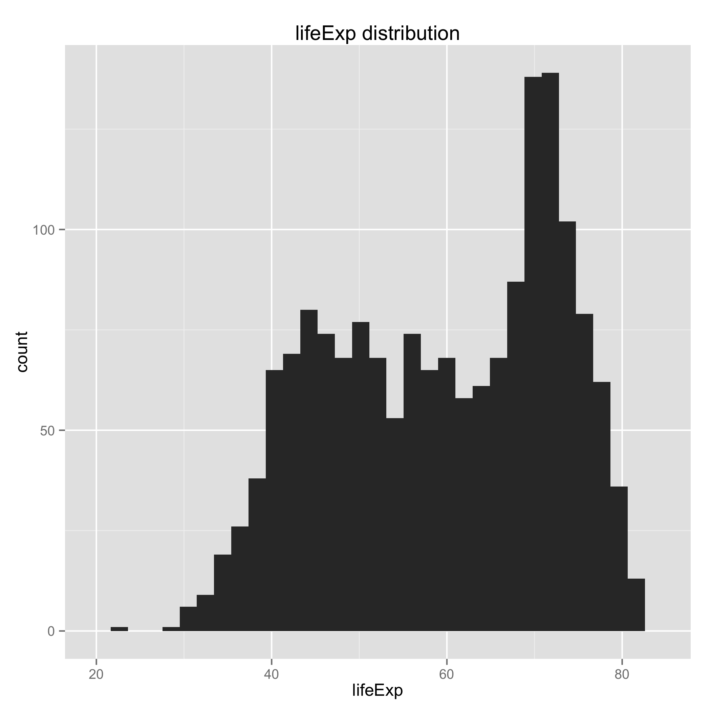
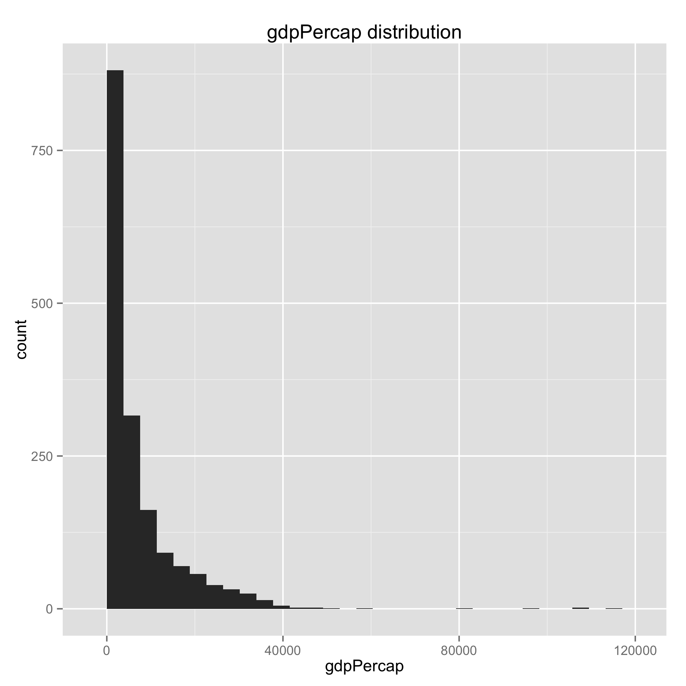
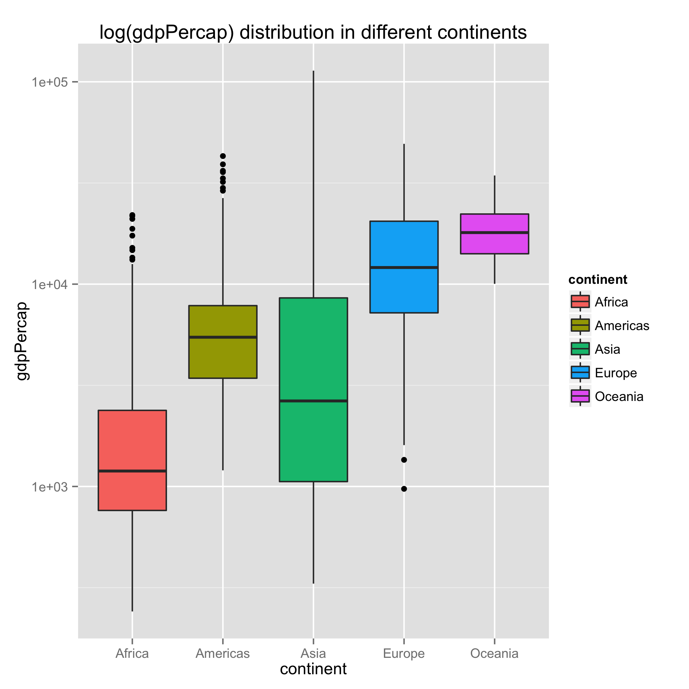
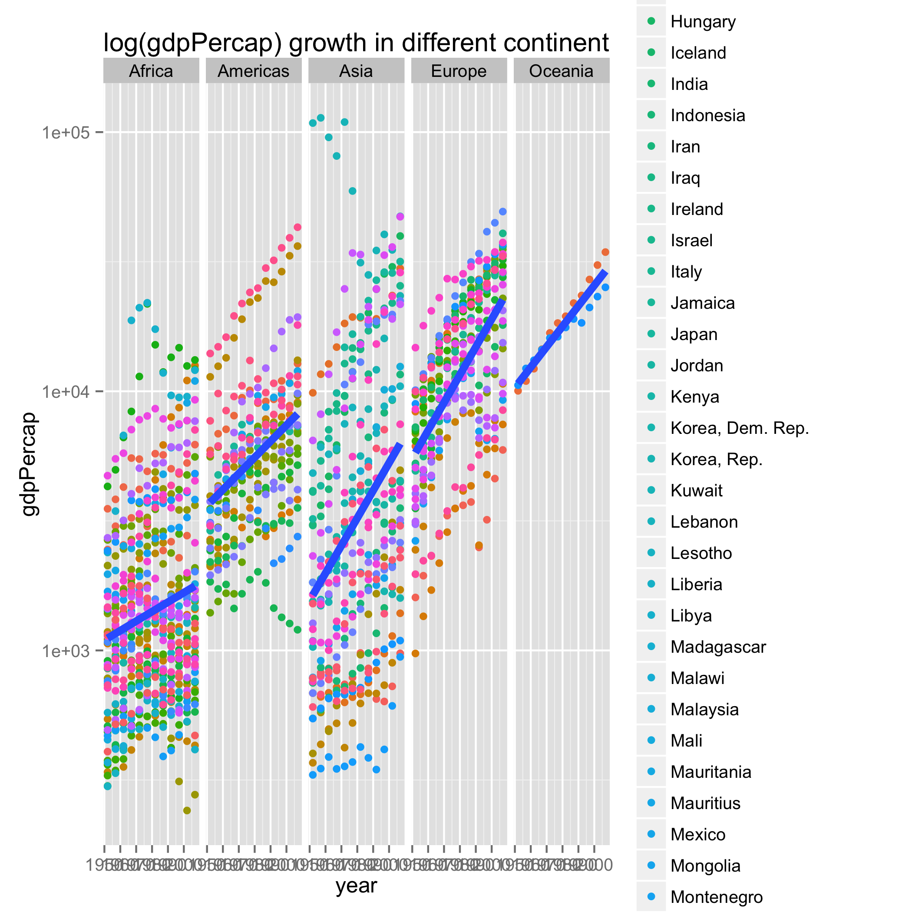
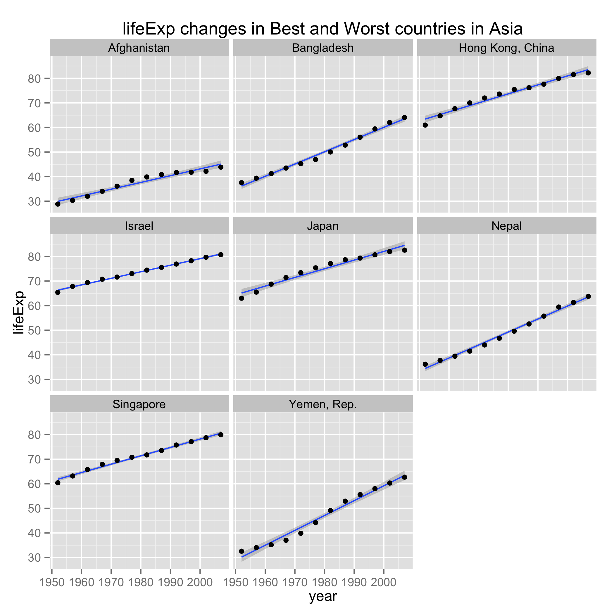
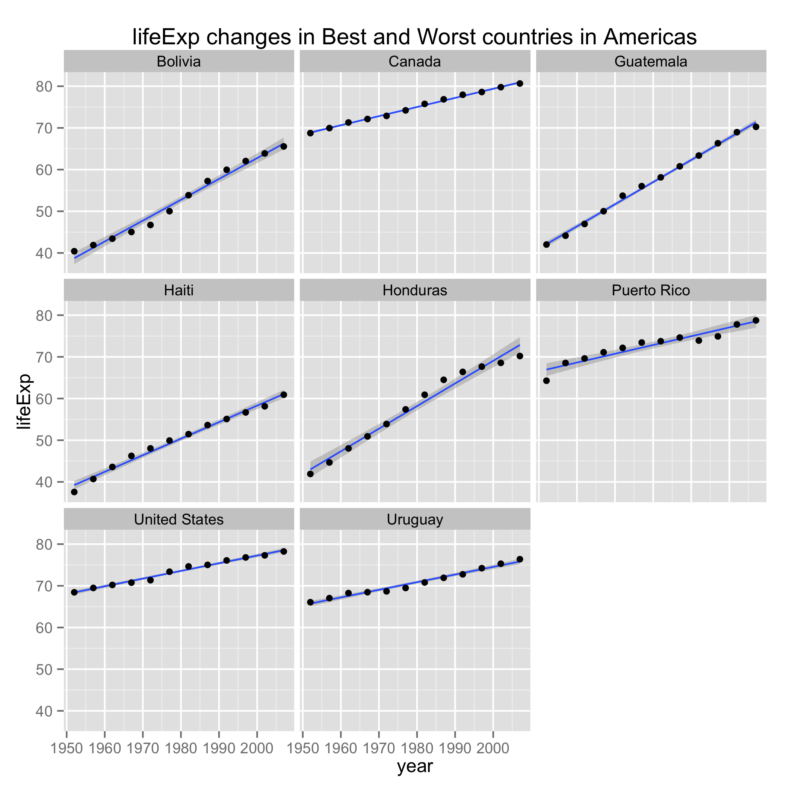

# Perform exploratory analyses
```{r, Download, eval = FALSE}
library(downloader)
download(url = "https://raw.githubusercontent.com/jennybc/gapminder/master/inst/gapminder.tsv", destfile = "gapminder.tsv")

#Bring in the data as data frame
library(readr)
gapminder <- read.delim("gapminder2.tsv")
str(gapminder)

#Descriptive plots
#remove the oc
library(ggplot2)
library(dplyr)
freq <- as.data.frame(table(gapminder$continent))
names(freq) <- c("continent","obs")
kable(freq,format = "markdown")

barplot(table(gapminder$continent))

p1 <- ggplot(gapminder,aes(x=lifeExp)) + geom_histogram()+ggtitle("lifeExp distribution")
p2 <- ggplot(gapminder,aes(x=gdpPercap)) + geom_histogram()+ggtitle("gdpPercap distribution")
p3 <- ggplot(gapminder,aes(x=continent, y=gdpPercap)) + geom_boxplot(aes(fill=continent)) + 
	scale_y_log10() + ggtitle("log(gdpPercap) distribution in different continents")
p4 <- ggplot(gapminder,aes(x=year, y=gdpPercap)) + 
	geom_point(aes(color = country)) + 
	geom_smooth(lwd = 2, se= FALSE, method = "lm") + 
	scale_y_log10() + facet_grid(~continent) +
	ggtitle("log(gdpPercap) growth in different continent")

ggsave(file="lifeExp_dist.png",plot=p1)
ggsave(file="gdpPercap_dist.png",plot=p2)
ggsave(file="gdpPercap_dist_continent.png",plot=p3)
ggsave(file="gdpPercap_growth_continent.png",plot=p4)

# Reorder the continents based on life expectancy according to the cross-country 
# difference of lifeExp in each continent 2007. 

gap <- gapminder %>% 
	filter(year==2007) %>% 
	group_by(continent) %>% 
	summarise(diff = max(lifeExp)-min(lifeExp))

gap <- full_join(gapminder,gap)
gapminder <- gap %>% 
	mutate(continent=reorder(continent,diff))
levels(gapminder$continent)
# sort the data according to continent, country, and year variable
sort <- gapminder[order(gapminder$continent,gapminder$country, gapminder$year),]

write_tsv(sort,"gap_sort.tsv")
```
#### I reorder the continent factor according to the biggest difference between countries in the same continent in year 2007. And add the variable `diff` into gapminder data in order to quickly reorder continent when reloading the file. 
Descriptive plots:





# Perform statistical analyses

#### The "worst" and "best" countries are picked according to the value of intercept, which is seen as the "default" lifeExp. 

```{r,analysis,eval=FALSE}
# import the data from download.R
library(readr)
gapminder <- read.delim("gap_sort.tsv") #I want continents treated as factors
str(gapminder)
#make sure new continent order is still in force
gapminder <- gapminder %>% 
	mutate(continent=reorder(continent,diff))
levels(gapminder$continent)

library(plyr)
library(dplyr)
# linear regression of life expectancy on year
reg <- ddply(gapminder, ~ country + continent,fn <- function(dat, offset = 1952) {
	the_fit <- lm(lifeExp ~ I(year - offset), dat)
	sd <- var(residuals(the_fit), na.rm = TRUE)
	setNames(c(coef(the_fit),sd), c("intercept", "slope","sd"))
})

reg <- reg[order(reg$continent,reg$country),]
#write results to file
write_tsv(reg,"reg_life_year.tsv")

# find the 3 or 4 “worst” and “best” countries for each continent
rank_int <- reg %>% 
	group_by(continent) %>% 
	filter(min_rank(intercept)<5 | min_rank(desc(intercept))<5)

write_tsv(rank_int,"reg_worst_best.tsv")

```

# Generate figures

```{r, figure, eval=FALSE}
library(dplyr)
library(readr)
library(ggplot2)
gapminder <- read_tsv("gap_sort.tsv")
rank_int <- read_tsv("reg_worst_best.tsv")
pick <- semi_join(gapminder,rank_int,by="country")
pick$continent <- as.factor(pick$continent)
pick$country <- as.factor((pick$country))
str(pick)


for (i in levels(pick$continent)){
	ggplot(pick %>% filter(continent==i),aes(x = year,y = lifeExp)) +
		geom_smooth(se = TRUE, method = "lm") + 
		geom_point() + facet_wrap(~country)+ggtitle(paste("lifeExp changes in Best and Worst countries in",i,sep=" "))
	k <- paste("lifeExp_growth_",i,".png",sep="")
	ggsave(k)
}
```

#### The final analysis graphs of  for each continent. 






